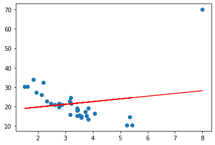

# DATA 1 Practical 9

Simos Gerasimou


## "...all models are wrong, but some are useful. However, the approximate nature of the model must always be borne in mind...." (George Box) [Wikipedia](https://en.wikipedia.org/wiki/All_models_are_wrong)

**Pandas API Reference**: https://pandas.pydata.org/pandas-docs/stable/reference/index.html

**Matplotlib API Reference**: https://matplotlib.org/3.1.1/api/index.html

**Seaborn API Reference**: https://seaborn.pydata.org/api.html

**Scipy Stats API Reference**: https://docs.scipy.org/doc/scipy/reference/stats.html

**Linear regrression on Scikit Learn**: https://scikit-learn.org/stable/modules/linear_model.html#ordinary-least-squares


```python
import numpy as np
import matplotlib.pyplot as plt
import seaborn as sns
from scipy import stats
import math as m
import pandas as pd

from sklearn import linear_model #Check this
from sklearn import metrics
from sklearn.preprocessing import PolynomialFeatures
from sklearn.pipeline import make_pipeline
```

***

## **Linear Regression Example (from Lecture)**


```python
#Create dataframe
priceYork = [275000, 282500, 305000, 340000, 362500]
areaYork  = [2600, 3000, 3200, 3600, 4000]
dfYork = pd.DataFrame(data={"Area":areaYork, "Price":priceYork})

#Create a linear regression object
reg = linear_model.LinearRegression()

#Train the model: pay attention to how the data are expected by the linear regression model
reg.fit(X=np.array(areaYork).reshape(-1, 1), y=priceYork)

#Predict the price for a property with area 3300
area = 3300
result = reg.predict([[area]])

print ("The price of a property of %d square feet is £%.2f" % (area, result))
np.array(areaYork).reshape(-1, 1)
```

    The price of a property of 3300 square feet is £314357.88


    array([[2600],
           [3000],
           [3200],
           [3600],
           [4000]])


***

## **Linear Regression Part A**

DataVision has been commissioned by the York City Council to analyse a set of data regarding citizens of Yorkshire and extract actionable knowledge.

The dataset for Yorkhire citizens is available on VLE (look for yorkshire.csv in the Practicals section)


**TA1) Load the Yorkshire dataset using Pandas**

**Note**: You have to download the dataset on your local machine and then load it onto the Jupyter Notebook


```python
df = pd.read_csv('yorkshire.csv')
```

**TA2) Produce a scatter plot showing the age VS income**


```python
plt.scatter(df.age, df.income)
```


    <matplotlib.collections.PathCollection at 0x7f34176b31c0>


    

    


**TA3) Train a linear regression model to determine the "best line of fit" for this data using only the Year as the input variable**

* **Hint**: 
   * You might want to use the following library: from sklearn import linear_model
   * You might want to check https://scikit-learn.org/stable/modules/generated/sklearn.linear_model.LinearRegression.html
   * Pay attention to how the data should be shaped


```python
reg = linear_model.LinearRegression()
X = df.age.values.reshape(-1,1)
y = df.income

reg.fit(X=X, y=y)
plt.scatter(X, y)
plt.plot(X, reg.predict(X), 'r')
```


    [<matplotlib.lines.Line2D at 0x7f341761fb20>]


    

    


**TA4) Extract and report the coefficients (regression and intercept coefficient) of the trained linear regression model**


```python
reg.coef_[0], reg.intercept_
```


    (539.1150726420369, 3631.490230865249)


**TA5) Calculate the regression and intercept coefficients using their formulae and confirm that they match the result derived in task TA4**


```python
f = lambda x: x * reg.coef_[0] + reg.intercept_
x = np.arange(18, 70)

plt.scatter(X, y)
plt.plot(X, reg.predict(X), 'r--', linewidth=5)
plt.plot(x, f(x), 'g--', linewidth=5)
```


    [<matplotlib.lines.Line2D at 0x7f3415591610>]


    

    


**TA6) Using your age, make a prediction about your income in 10 years time (i.e., your age in 2031). Also, report the complete linear regression model**


```python
reg.predict([[18 + 10]])[0]
```


    18726.71226484228


**TA7) Plot the linear regression model alongside the scatter plot from TA2**

**Hint:** 
  * Invoke the plotting functions (one for the scatter plot, one for the linear regression model) one after the other
  * To generate the linear regression model, you can use (i) high school maths or (ii) the predict() method of the LinearRegression library


```python
plt.scatter(X, y)
plt.plot(X, reg.predict(X), 'r')
```


    [<matplotlib.lines.Line2D at 0x7f34154e9dc0>]


    

    


*** 

## **Linear Regression Part B**

A dietetics and nutrition instructor wants to analyse how well educated are sports science students about the usefuleness of calcium and its recommended daily intake. Also, the instructor wants to examine if knowledge about calcium can be used to predict calcium intake of the students. To answer these questions, the instructor collected data from 20 students about their calcium knowledge and calcium intake per day.


**TB1) Load the Nutrition dataset using Pandas**

**Note**: You have to download the dataset on your local machine and then load it onto the Jupyter Notebook


```python
df = pd.read_csv('nutrition.csv')
```

**TB2) Which is the independent and which is the dependent variable?**


```python
print("Independant: KnowledgeScore, Dependant: CalciumIntake")
```

    Independant: KnowledgeScore, Dependant: CalciumIntake


**TB3) Plot a scatter plot having the independent variable on the X axis. Do you see any relationship between the variables?**


```python
plt.scatter(df.KnowledgeScore, df.CalciumIntake)
# positive correlation
```


    <matplotlib.collections.PathCollection at 0x7f34154be9d0>


    

    


**TB4) Calculate the Pearson correlation coefficient. You must show your calculations, i.e., calculate the result analytically, but you may use the appropriate scipy.stats function (or other) to check your result.**


```python
import math
x = df.KnowledgeScore
y = df.CalciumIntake
( sum( (x - x.mean()) * (y - y.mean()) )) / math.sqrt( sum((x - x.mean())**2) * sum( (y - y.mean())**2 )  )
```


    0.8822551379904903


**TB5) What do you think of the correlation between these two variables? What do you expect the linear regression model to be?**

There is not enough samples to conclude a correlation however the sample given does show a strong positive correlation

**TB6) Train a simple linear regression model to determine the "best line of fit" for this data**


```python
reg = linear_model.LinearRegression()
X = df.KnowledgeScore.values.reshape(-1,1)
y = df.CalciumIntake

reg.fit(X=X, y=y)
plt.scatter(X, y)
plt.plot(X, reg.predict(X), 'r')
```


    [<matplotlib.lines.Line2D at 0x7f3415434400>]


    

    


**TB7) Report the regression and intercept coefficients of this linear regression model. Report also the final formula of the linear regression model.**


```python
m, c = reg.coef_[0], reg.intercept_
print(f"y = {m}x + {c}")
```

    y = 13.897200274819642x + 373.7428718653386


**TB8) Calculate the regression and intercept coefficients using their formulae and confirm that they match the result derived in task TB7**


```python
x, y = df.KnowledgeScore, df.CalciumIntake
m = ( len(x) * sum(x * y) - sum(x) * sum(y) ) / ( len(x) * sum(x**2) - sum(x)**2 )
c = ( sum(y) * sum(x**2) - sum(x) * sum(x * y) ) / ( len(x) * sum(x**2) - sum(x)**2 )
print(f"y = {m}x + {c}")
```

    y = 13.89720027481965x + 373.7428718653384


**TB9) Calculate the goodness of fit $R^2$. You must show your calculations, i.e., calculate the result analytically, but you may use the appropriate sklearn.metrics method to check your result.**

**Hint:** 
   * You might want to check https://scikit-learn.org/stable/modules/classes.html#module-sklearn.metrics
   * To derive the $R^2$ score you need to make predictions (see lecture slides for the formulae). You may use the same dataset (used for training) for making predictions.


```python
f = lambda x: m * x + c
rss = sum( (y - f(x))**2 )
tss = sum( (y - y.mean())**2 )

1 - rss/tss
```


    0.7783741285106188


**TB10) Plot the linear regression model alongside the scatter plot from task TB3**


```python
reg = linear_model.LinearRegression()
X = df.KnowledgeScore.values.reshape(-1,1)
y = df.CalciumIntake

reg.fit(X=X, y=y)
plt.scatter(X, y)
plt.plot(X, reg.predict(X), 'r')
```


    [<matplotlib.lines.Line2D at 0x7f341541e3d0>]


    

    


**TB11) Calculate the approximate calcium intake of a student with knowledge of calcium score equal to 30 (out of 50).**


```python
reg.predict([[30]])[0]
```


    790.6588801099278


*** 

## Linear Regression Part C

John Doe is interested in buying a car and wants to find one that would have an acceptable fuel consumption (in terms of miles per galon). In order to decide, he collected data from AutoTrader and other car websites and wants to analyse this data and produce regression models that will help him to make better predictions. 

**TC1) Load the cars dataset using Pandas**

**Note**: You have to download the dataset on your local machine and then load it onto the Jupyter Notebook


```python
df = pd.read_csv('cars.csv')
```

**TC2) Try to understand what the variables mean. If this is unclear, go to the end of this document. Also, which are the independent variables and which is the dependent variable?**


**TC3) Plot a scatter plot having the weight (wt) on the X axis and miles per gallon on the Y axis. Do you see any relationship between the variables?**


```python
plt.scatter(df.wt, df.mpg)
```


    <matplotlib.collections.PathCollection at 0x7f34154a0a60>


    

    


**TC4) Train a simple linear regression model to determine the "best line of fit" between weight and miles per gallon and report the the final form of the regression model**


```python
reg = linear_model.LinearRegression()
X = df.wt.values.reshape(-1, 1)
y = df.mpg

reg.fit(X=X, y=y)
plt.scatter(X, y)
plt.plot(X, reg.predict(X), 'r')
```


    [<matplotlib.lines.Line2D at 0x7f3414ea2730>]


    

    


**TC5) Calculate 𝑅2 , Mean Absolute Error, Mean Squared Error and Root Mean Squared Error of this linear regression model. You may use the appropriate sklearn.metrics methods (no need to implement them again)**

**Hint:** You might want to check https://scikit-learn.org/stable/modules/classes.html#module-sklearn.metrics


```python
r2 = metrics.r2_score(reg.predict(X), y)
m_abs_err = metrics.mean_absolute_error(reg.predict(X), y)
root_m2_err = metrics.mean_squared_error(y, reg.predict(X))
r2, m_abs_err, root_m2_err
```


    (0.671683794298243, 2.340641858325169, 8.697560548229477)


**TC6) Try to break the prediction model by adding an influential (extreme) data item. How would this data item be like? Append this data item to your original dataframe, train and plot a new regression model.**

* You may want to add a supercar {"mpg":70,"wt":8}


```python
X = np.append(df.wt, [[8]]).reshape(-1, 1)
y = np.append(df.mpg, [70])

reg.fit(X=X, y=y)
plt.scatter(X, y)
plt.plot(X, reg.predict(X), 'r')
```


    [<matplotlib.lines.Line2D at 0x7f3413bd3760>]


    

    


**TC7) Calculate 𝑅2, Mean Absolute Error, Mean Squared Error and Root Mean Squared Error of this NEW linear regression model. You may use the appropriate sklearn.metrics methods. What is the difference with the results in TC5?**


```python
r2 = metrics.r2_score(x, reg.predict(X))
m_abs_err = metrics.mean_absolute_error(X, reg.predict(X))
root_m2_err = metrics.mean_squared_error(y, reg.predict(X))
r2, m_abs_err, root_m2_err
```


    ---------------------------------------------------------------------------

    ValueError                                Traceback (most recent call last)

    <ipython-input-65-5491f1e0c358> in <module>
    ----> 1 r2 = metrics.r2_score(x, reg.predict(X))
          2 m_abs_err = metrics.mean_absolute_error(X, reg.predict(X))
          3 root_m2_err = metrics.mean_squared_error(y, reg.predict(X))
          4 r2, m_abs_err, root_m2_err


    ~/.local/lib/python3.8/site-packages/sklearn/utils/validation.py in inner_f(*args, **kwargs)
         61             extra_args = len(args) - len(all_args)
         62             if extra_args <= 0:
    ---> 63                 return f(*args, **kwargs)
         64 
         65             # extra_args > 0


    ~/.local/lib/python3.8/site-packages/sklearn/metrics/_regression.py in r2_score(y_true, y_pred, sample_weight, multioutput)
        674     -3.0
        675     """
    --> 676     y_type, y_true, y_pred, multioutput = _check_reg_targets(
        677         y_true, y_pred, multioutput)
        678     check_consistent_length(y_true, y_pred, sample_weight)


    ~/.local/lib/python3.8/site-packages/sklearn/metrics/_regression.py in _check_reg_targets(y_true, y_pred, multioutput, dtype)
         86         the dtype argument passed to check_array.
         87     """
    ---> 88     check_consistent_length(y_true, y_pred)
         89     y_true = check_array(y_true, ensure_2d=False, dtype=dtype)
         90     y_pred = check_array(y_pred, ensure_2d=False, dtype=dtype)


    ~/.local/lib/python3.8/site-packages/sklearn/utils/validation.py in check_consistent_length(*arrays)
        260     uniques = np.unique(lengths)
        261     if len(uniques) > 1:
    --> 262         raise ValueError("Found input variables with inconsistent numbers of"
        263                          " samples: %r" % [int(l) for l in lengths])
        264 


    ValueError: Found input variables with inconsistent numbers of samples: [20, 33]


**TC8) Looking at the plot in task TC3, it might be possible to fit a better model through polynomial regression. Try to fit a polynomial regression model of degree 2.**

* Hint: You might want to check https://scikit-learn.org/stable/modules/generated/sklearn.preprocessing.PolynomialFeatures.html


```python
X = df.wt.values.reshape(-1, 1)
y = df.mpg
poly = PolynomialFeatures()
X_poly = poly.fit_transform(X)

reg = linear_model.LinearRegression()
reg.fit(X_poly, y)

x_seq = np.linspace(min(X), max(X), 1000)
x_poly_seq = poly.fit_transform(x_seq)
plt.plot(x_poly_seq[:, 1], reg.predict(x_poly_seq), 'r')
plt.scatter(df.wt, df.mpg)
```


    <matplotlib.collections.PathCollection at 0x7f341528c400>


    

    


**TC9) Print the new intercept and regression coefficients of the new regression model**


```python
reg.coef_, reg.intercept_
```


    (array([  0.        , -13.38033708,   1.17108689]), 49.93081094945184)


**TC10) Plot the polynomial regression model alongside the scatter plot**


```python
plt.plot(x_poly_seq[:, 1], reg.predict(x_poly_seq), 'r')
plt.scatter(df.wt, df.mpg)
```


    <matplotlib.collections.PathCollection at 0x7f34151e5790>


    

    


**TC11) Following from task TC8, try to fit and plot a polynomial regression model of degree 10**


```python
poly = PolynomialFeatures(10)
X_poly = poly.fit_transform(X)

reg = linear_model.LinearRegression()
reg.fit(X_poly, y)

x_seq = np.linspace(min(X), max(X), 1000)
x_poly_seq = poly.fit_transform(x_seq)
plt.plot(x_poly_seq[:, 1], reg.predict(x_poly_seq), 'r')
plt.scatter(df.wt, df.mpg)
plt.show()
```


    

    


**TC12) Calculate the Pearson correlation coefficient for several other variables to check how they are collerated with the mpg  variable. You may use the  scipy.stats.pearsonr method or similar.**

**Hint:** Think which variables might increase or decrease fuel consumption


```python
print('no of cylinders: %s' % stats.pearsonr(df.cyl, df.mpg)[0])
print('horsepower: %s' % stats.pearsonr(df.hp, df.mpg)[0])
print('rear axle ratio: %s' % stats.pearsonr(df.drat, df.mpg)[0])
```

    no of cylinders: -0.8521619594266132
    horsepower: -0.7761683718265864
    rear axle ratio: 0.6811719078067493


**TC13) Select two variables that are most strongly (positively or negatively) correlated with mpg and train a multiple linear regression model**

**Hint:** The commands are exactly the same (with more dimensions in the independent variables) as in TC4


```python
reg = linear_model.LinearRegression()
X = df[['hp', 'drat']]
y = df.mpg

reg.fit(X=X, y=y)
reg.predict(np.array([[15, 15]]))
```


    array([80.48542792])


**TC14) Calculate  𝑅2 , Mean Absolute Error, Mean Squared Error and Root Mean Squared Error of this multiple linear regression model. You may use the appropriate sklearn.metrics methods.**


```python
r2 = metrics.r2_score(y, reg.predict(X))
m_abs_err = metrics.mean_absolute_error(y, reg.predict(X))
root_m2_err = metrics.mean_squared_error(y, reg.predict(X))
r2, m_abs_err, root_m2_err
```


    (0.7411716018465505, 2.3502399001320713, 9.107905930806936)


```python
### Cars dataset variables
# mpg:   Miles/(US) gallon
# cyl:   Number of cylinders
# disp:  Displacement (cu.in.), the measure of the cylinder volum
# hp:    Gross horsepower
# drat:  Rear axle ratio
# wt:    Weight (lb/1000)
# qsec:  1/4 mile time
# vs:    V type engine
# am:    Transmission (0 = automatic, 1 = manual)
# gear:  Number of forward gears
# carb:  Number of carburetors
```
